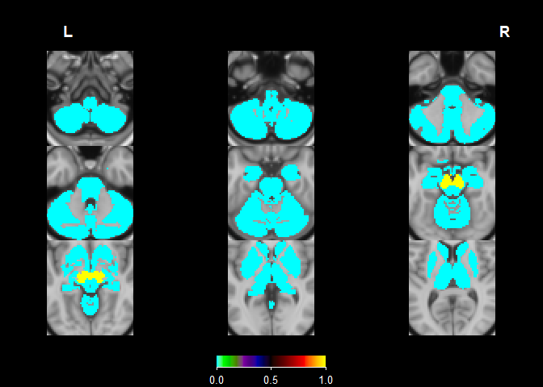

Use MNI NIFIT to create subcortical ROI mask in CIFTI
================
Joern Alexander Quent
2024-07-16

# Aim

Here, I will try to use a MNI NIFTI file to create a subcortical ROI
mask in CIFTI format.

Thanks to @damondpham on GitHub for the code pointing to the right
direction ([here](https://github.com/mandymejia/ciftiTools/issues/61)).

# Libraries used

``` r
library(oro.nifti)
library(ciftiTools)
ciftiTools.setOption("wb_path", "C:/Program Files/workbench/bin_windows64")
```

    ## Using this Workbench path: 'C:/Program Files/workbench/bin_windows64/wb_command.exe'.

<details>
<summary>
Click here for detailed session information.
</summary>

``` r
sessioninfo::session_info()
```

    ## ─ Session info ───────────────────────────────────────────────────────────────
    ##  setting  value
    ##  version  R version 4.3.3 (2024-02-29 ucrt)
    ##  os       Windows 10 x64 (build 19045)
    ##  system   x86_64, mingw32
    ##  ui       RTerm
    ##  language EN
    ##  collate  English_United Kingdom.utf8
    ##  ctype    English_United Kingdom.utf8
    ##  tz       Asia/Shanghai
    ##  date     2024-07-16
    ##  pandoc   3.1.11 @ C:/Program Files/RStudio/resources/app/bin/quarto/bin/tools/ (via rmarkdown)
    ## 
    ## ─ Packages ───────────────────────────────────────────────────────────────────
    ##  package      * version date (UTC) lib source
    ##  abind          1.4-5   2016-07-21 [1] CRAN (R 4.3.1)
    ##  base64enc      0.1-3   2015-07-28 [1] CRAN (R 4.3.1)
    ##  bitops         1.0-7   2021-04-24 [1] CRAN (R 4.3.1)
    ##  ciftiTools   * 0.15.1  2024-06-25 [1] CRAN (R 4.3.3)
    ##  cli            3.6.2   2023-12-11 [1] CRAN (R 4.3.3)
    ##  digest         0.6.35  2024-03-11 [1] CRAN (R 4.3.3)
    ##  evaluate       0.23    2023-11-01 [1] CRAN (R 4.3.3)
    ##  fastmap        1.2.0   2024-05-15 [1] CRAN (R 4.3.3)
    ##  gifti          0.8.0   2020-11-11 [1] CRAN (R 4.3.3)
    ##  htmltools      0.5.8.1 2024-04-04 [1] CRAN (R 4.3.3)
    ##  knitr          1.47    2024-05-29 [1] CRAN (R 4.3.3)
    ##  oro.nifti    * 0.11.4  2022-08-10 [1] CRAN (R 4.3.3)
    ##  R.methodsS3    1.8.2   2022-06-13 [1] CRAN (R 4.3.3)
    ##  R.oo           1.26.0  2024-01-24 [1] CRAN (R 4.3.3)
    ##  R.utils        2.12.3  2023-11-18 [1] CRAN (R 4.3.3)
    ##  RColorBrewer   1.1-3   2022-04-03 [1] CRAN (R 4.3.1)
    ##  Rcpp           1.0.12  2024-01-09 [1] CRAN (R 4.3.3)
    ##  rlang          1.1.3   2024-01-10 [1] CRAN (R 4.3.3)
    ##  rmarkdown      2.27    2024-05-17 [1] CRAN (R 4.3.3)
    ##  RNifti         1.6.1   2024-03-07 [1] CRAN (R 4.3.3)
    ##  rstudioapi     0.16.0  2024-03-24 [1] CRAN (R 4.3.3)
    ##  sessioninfo    1.2.2   2021-12-06 [1] CRAN (R 4.3.3)
    ##  viridisLite    0.4.2   2023-05-02 [1] CRAN (R 4.3.3)
    ##  xfun           0.44    2024-05-15 [1] CRAN (R 4.3.3)
    ##  xml2           1.3.6   2023-12-04 [1] CRAN (R 4.3.3)
    ##  yaml           2.3.8   2023-12-11 [1] CRAN (R 4.3.2)
    ## 
    ##  [1] C:/Users/alex/AppData/Local/R/win-library/4.3
    ##  [2] C:/Program Files/R/R-4.3.3/library
    ## 
    ## ──────────────────────────────────────────────────────────────────────────────

</details>

# Load a cifti file to use as a template

I load a z-map from a group-level analysis as a template so that the new
xifti/cifti matches our data.

``` r
# Load z-map
cifti_temp <- "E:/Seafile/imaging_results/SpaNov/OLMe_7T_SpaNov_gradient_6lvl_smo4_MSMAll/cope7.feat/stats/vwc/results_lvl2cope1_dat_ztstat_c1.dscalar.nii"
temp_xii   <- read_cifti(cifti_temp, brainstructures = "all")

# Create empty xifti based on this template
new_xii <- newdata_xifti(temp_xii, 0)
```

# Load the MNI NIFTI file

Next, I load the MNI image that I want to use as a mask for my analysis.

``` r
# https://www.r-bloggers.com/2014/10/working-with-nifti-images-in-r/
ROI_nii <- readNIfTI("E:/Seafile/imaging_results/Midbrain_Atlases_all/mean_fullMB.nii.gz")
ROI_nii <- cal_img(ROI_nii) # Not sure if this is necessary
```

Based on the information below, the .nii image should be in the right
format.

``` r
print(ROI_nii)
```

    ## NIfTI-1 format
    ##   Type            : nifti
    ##   Data Type       : 16 (FLOAT32)
    ##   Bits per Pixel  : 32
    ##   Slice Code      : 0 (Unknown)
    ##   Intent Code     : 0 (None)
    ##   Qform Code      : 4 (MNI_152)
    ##   Sform Code      : 4 (MNI_152)
    ##   Dimension       : 91 x 109 x 91
    ##   Pixel Dimension : 2 x 2 x 2
    ##   Voxel Units     : mm
    ##   Time Units      : sec

For instance, the subcortical mask of our cifti file has the following
dimensions:

``` r
dim(temp_xii$meta$subcort$mask)
```

    ## [1]  91 109  91

# Using nifti matrix to create a mask

As the first step, we will binary the group-level mask by rounding.

``` r
ROI_nii_bin <- round(ROI_nii)
```

Use the cifti mask to create a one-dimensional matrix that has the
correct number of rows that we need for our cifti data (31870 data
voxels).

``` r
# Use the subcortical mask of the cifti file to create a one-dimensional matrix/vector
subcort_mask   <- new_xii$meta$subcort$mask
subcort_matrix <- ROI_nii_bin[subcort_mask]

# Add this as new data to the xifti object
new_xii$data$subcort <- matrix(subcort_matrix, nrow = length(subcort_matrix), ncol = 1)
```

Now, `subcort_matrix` has 31870 values, which is exactly the number of
voxels in the subcortical mask of the cifti file. If everything is
correct, our new object should pass the xifti test.

``` r
is.xifti(new_xii)
```

    ## [1] TRUE

# Visualise the result

``` r
view_cifti_volume(new_xii)
```

<!-- -->

Our ROI is supposed to cover the midbrain, which seems to be the case
based on the image above. Important: the subcortical mask from the CIFTI
cuts away from voxels from the mask.

# Create midbrain (SN/VTA) cifti ROI file

``` r
write_xifti(new_xii, "E:/Seafile/imaging_results/Midbrain_Atlases_all/SN_VTA_ROI.dscalar.nii")
```

    ## Writing left cortex.
    ## Writing right cortex.
    ## Writing subcortical data and labels.
    ## Creating CIFTI file from separated components.
