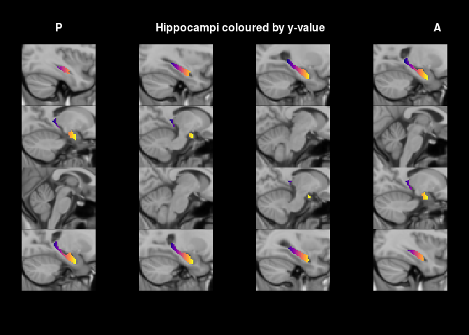
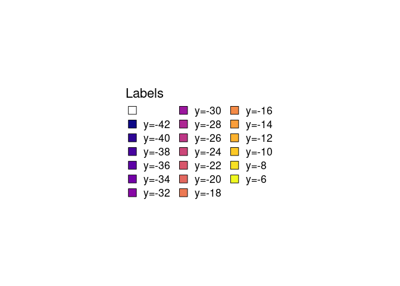
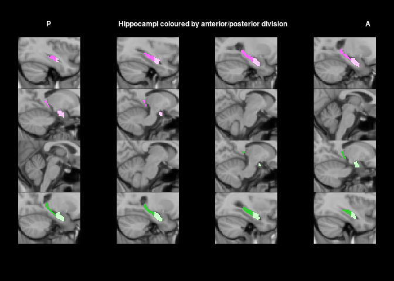
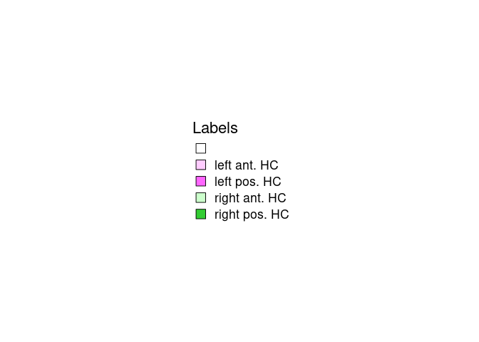
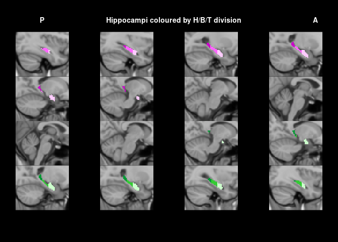
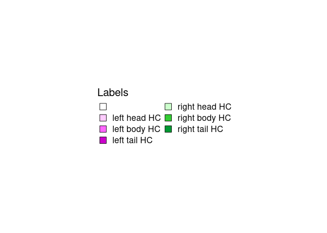
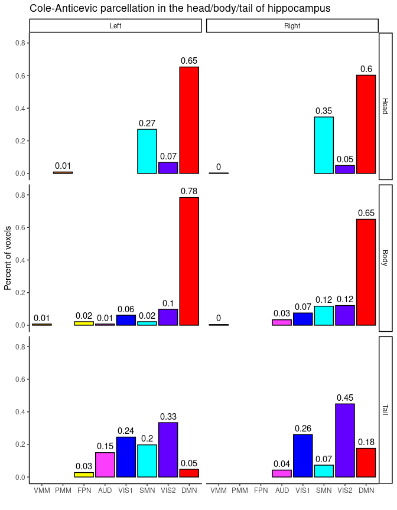

Notebook to create hippocampal masks along the longitudinal axis
================

# What do I want to do?

Here, I am creating a number of hippocampal masks that divide the
hippocampus along its longitudinal axis. While doing this, I try out the
R package `ciftiTools` and explore how it can be used for these kind of
operations. Additionally, we can investigate how the hippocampal
divisions differ from each other (e.g. in terms of Cole-Anticevic
network membership).

# Libraries used

``` r
# Load the ciftiTools package and point to the Connectome Workbench --------
library(cifti)
# devtools::install_github("mandymejia/ciftiTools", ref="12.0", upgrade = "never")
library(ciftiTools)
# Use correct location based on the computer used
if(Sys.info()[4] == "DESKTOP-335I26I"){
  # Work laptop
  ciftiTools.setOption("wb_path", "C:/Program Files/workbench-windows64-v1.5.0/workbench/bin_windows64")
} else if(Sys.info()[4] == 'DESKTOP-91CQCSQ') {
  ciftiTools.setOption("wb_path", "D:/workbench/bin_windows64")
} else if(Sys.info()[4] == 'alex-Zenbook-UX3404VA-UX3404VA') {
  ciftiTools.setOption("wb_path", "/usr/bin/wb_command")
} else {
  ciftiTools.setOption("wb_path", "D:/Program Files/workbench/bin_windows64")
}

# Load other packages --------
library(ggplot2)
library(cowplot)
library(assortedRFunctions)
library(plyr)
library(viridis)
library(knitr)
```

<details>
<summary>
Click here for detailed session information.
</summary>

``` r
sessioninfo::session_info()
```

    ## ─ Session info ───────────────────────────────────────────────────────────────
    ##  setting  value
    ##  version  R version 4.1.2 (2021-11-01)
    ##  os       Ubuntu 22.04.4 LTS
    ##  system   x86_64, linux-gnu
    ##  ui       X11
    ##  language (EN)
    ##  collate  en_US.UTF-8
    ##  ctype    en_US.UTF-8
    ##  tz       Asia/Shanghai
    ##  date     2024-05-10
    ##  pandoc   3.1.1 @ /usr/lib/rstudio/resources/app/bin/quarto/bin/tools/ (via rmarkdown)
    ## 
    ## ─ Packages ───────────────────────────────────────────────────────────────────
    ##  package            * version date (UTC) lib source
    ##  abind                1.4-5   2016-07-21 [1] CRAN (R 4.1.2)
    ##  assortedRFunctions * 0.0.1   2024-03-24 [1] Github (JAQuent/assortedRFunctions@f40bda9)
    ##  base64enc            0.1-3   2015-07-28 [1] CRAN (R 4.1.2)
    ##  bitops               1.0-7   2021-04-24 [1] CRAN (R 4.1.2)
    ##  cifti              * 0.4.5   2018-02-01 [1] CRAN (R 4.1.2)
    ##  ciftiTools         * 0.12.2  2023-08-15 [1] CRAN (R 4.1.2)
    ##  cli                  3.6.1   2023-03-23 [1] CRAN (R 4.1.2)
    ##  colorspace           2.1-0   2023-01-23 [1] CRAN (R 4.1.2)
    ##  cowplot            * 1.1.1   2020-12-30 [1] CRAN (R 4.1.2)
    ##  digest               0.6.33  2023-07-07 [1] CRAN (R 4.1.2)
    ##  dplyr                1.1.3   2023-09-03 [1] CRAN (R 4.1.2)
    ##  evaluate             0.22    2023-09-29 [1] CRAN (R 4.1.2)
    ##  fansi                1.0.5   2023-10-08 [1] CRAN (R 4.1.2)
    ##  fastmap              1.1.1   2023-02-24 [1] CRAN (R 4.1.2)
    ##  generics             0.1.3   2022-07-05 [1] CRAN (R 4.1.2)
    ##  ggplot2            * 3.4.4   2023-10-12 [1] CRAN (R 4.1.2)
    ##  gifti                0.8.0   2020-11-11 [1] CRAN (R 4.1.2)
    ##  glue                 1.6.2   2022-02-24 [1] CRAN (R 4.1.2)
    ##  gridExtra            2.3     2017-09-09 [1] CRAN (R 4.1.2)
    ##  gtable               0.3.4   2023-08-21 [1] CRAN (R 4.1.2)
    ##  htmltools            0.5.6.1 2023-10-06 [1] CRAN (R 4.1.2)
    ##  knitr              * 1.44    2023-09-11 [1] CRAN (R 4.1.2)
    ##  lifecycle            1.0.3   2022-10-07 [1] CRAN (R 4.1.2)
    ##  magrittr             2.0.3   2022-03-30 [1] CRAN (R 4.1.2)
    ##  munsell              0.5.0   2018-06-12 [1] CRAN (R 4.1.2)
    ##  oro.nifti            0.11.4  2022-08-10 [1] CRAN (R 4.1.2)
    ##  pillar               1.9.0   2023-03-22 [1] CRAN (R 4.1.2)
    ##  pkgconfig            2.0.3   2019-09-22 [1] CRAN (R 4.1.2)
    ##  plyr               * 1.8.9   2023-10-02 [1] CRAN (R 4.1.2)
    ##  R.methodsS3          1.8.2   2022-06-13 [1] CRAN (R 4.1.2)
    ##  R.oo                 1.25.0  2022-06-12 [1] CRAN (R 4.1.2)
    ##  R.utils              2.12.2  2022-11-11 [1] CRAN (R 4.1.2)
    ##  R6                   2.5.1   2021-08-19 [1] CRAN (R 4.1.2)
    ##  RColorBrewer         1.1-3   2022-04-03 [1] CRAN (R 4.1.2)
    ##  Rcpp                 1.0.11  2023-07-06 [1] CRAN (R 4.1.2)
    ##  rlang                1.1.1   2023-04-28 [1] CRAN (R 4.1.2)
    ##  rmarkdown            2.25    2023-09-18 [1] CRAN (R 4.1.2)
    ##  RNifti               1.5.0   2023-05-17 [1] CRAN (R 4.1.2)
    ##  rstudioapi           0.15.0  2023-07-07 [1] CRAN (R 4.1.2)
    ##  scales               1.2.1   2022-08-20 [1] CRAN (R 4.1.2)
    ##  sessioninfo          1.2.2   2021-12-06 [1] CRAN (R 4.1.2)
    ##  tibble               3.2.1   2023-03-20 [1] CRAN (R 4.1.2)
    ##  tidyselect           1.2.0   2022-10-10 [1] CRAN (R 4.1.2)
    ##  utf8                 1.2.4   2023-10-22 [1] CRAN (R 4.1.2)
    ##  vctrs                0.6.4   2023-10-12 [1] CRAN (R 4.1.2)
    ##  viridis            * 0.6.4   2023-07-22 [1] CRAN (R 4.1.2)
    ##  viridisLite        * 0.4.2   2023-05-02 [1] CRAN (R 4.1.2)
    ##  withr                2.5.1   2023-09-26 [1] CRAN (R 4.1.2)
    ##  xfun                 0.40    2023-08-09 [1] CRAN (R 4.1.2)
    ##  xml2                 1.3.5   2023-07-06 [1] CRAN (R 4.1.2)
    ##  yaml                 2.3.7   2023-01-23 [1] CRAN (R 4.1.2)
    ## 
    ##  [1] /home/alex/R/x86_64-pc-linux-gnu-library/4.1
    ##  [2] /usr/local/lib/R/site-library
    ##  [3] /usr/lib/R/site-library
    ##  [4] /usr/lib/R/library
    ## 
    ## ──────────────────────────────────────────────────────────────────────────────

</details>

# CIFTI files & other parameters

``` r
# CIFTI files
parcellationFile <- "sourceFiles/Q1-Q6_RelatedValidation210.CorticalAreas_dil_Final_Final_Areas_Group_Colors_with_Atlas_ROIs2.32k_fs_LR.dlabel.nii"
ColeAnticevic    <- "sourceFiles/CortexSubcortex_ColeAnticevic_NetPartition_wSubcorGSR_netassignments_LR.dlabel.nii"
surfLeft         <- "sourceFiles/S1200.L.inflated_MSMAll.32k_fs_LR.surf.gii"
surfRight        <- "sourceFiles/S1200.R.inflated_MSMAll.32k_fs_LR.surf.gii"

# Cole-Anticevic colours & names
coleAnticevic_colours = c("#0000FF", "#6400FF", "#00FFFF", "#990099", "#00FF00", 
                          "#009B9B", "#FFFF00", "#FA3EFB", "#FF0000", "#B15928",
                          "#FF9D00", "#417D00")

network_Fullnames <- c("Visual", "Visual2", "Somatomotor","Cingulo-Opercular", 
                   "Dorsal Attention", "Language", "Frontoparietal", "Auditory", 
                   "Default", "Posterior Multimodal", "Ventral Multimodal", 
                   "Orbito-Affective")
network_names <- c("VIS1", "VIS2", "SMN","CON", 
                   "DAN", "LAN", "FPN", "AUD", 
                   "DMN", "PMM", "VMM", "ORA") 

# coleAnticevic data frame
CA_df <- data.frame(network_Fullnames = network_Fullnames,
                    network_names = network_names,
                    colours = coleAnticevic_colours)
```

# What Cole-Anticevic networks can be found in the hippocampus?

Before, I am subdividing the hippocampus, I am curious to see which
Cole-Anticevic networks can be found in the hippocampus, which were
assigned by looking for the largest correlation of each voxel with the
12 cortical networks.

We start with using `ciftiTools` to load the Cole-Anticevic CIFTI file.

``` r
cifti_fname <- ColeAnticevic
xii_CA      <- ciftiTools::read_cifti(cifti_fname, brainstructures = "all", 
                                      surfL_fname = surfLeft, 
                                      surfR_fname = surfRight)
xii_info <- info_cifti(cifti_fname)
```

After loading the file, we can extract the voxels from the hippocampus
and visualise the distribution of network membership.

``` r
# Extract Cole-Anticevic parcellation from both hippocampi
HPC_L <- xii_CA$data$subcort[xii_info$subcort$labels == "Hippocampus-L"]
HPC_R <- xii_CA$data$subcort[xii_info$subcort$labels == "Hippocampus-R"]

# Add to one data frame
HPC_CA <- data.frame(Hemisphere = c(rep("Left", length(HPC_L)), rep("Right", length(HPC_R))),
                     Network_id = c(HPC_L, HPC_R))

# Convert Network_id to factor
HPC_CA$Network <- factor(HPC_CA$Network_id, levels = 1:12, labels = network_names)

# Calculate count
HPC_CA_agg <- ddply(HPC_CA, c("Hemisphere", "Network_id", "Network"), summarise, Count = length(Hemisphere))

# Calculate frequency for each hemisphere separately 
HPC_CA_agg <- ddply(HPC_CA_agg, c("Hemisphere"), mutate, Frequency = Count/sum(Count))

# Re order the factor so bar heights are increasing
current_networks   <- CA_df[network_names %in% unique(HPC_CA_agg$Network), ]
network_order      <- order(HPC_CA_agg$Frequency[HPC_CA_agg$Hemisphere == "Left"])
HPC_CA_agg$Network <- factor(HPC_CA_agg$Network, 
                           levels = current_networks[network_order, "network_names"], 
                           ordered = TRUE)

# Round values for adding them as text and create the height variable
heigthIncrease        <- max(HPC_CA_agg$Frequency) * 0.05
HPC_CA_agg$bar_height <- HPC_CA_agg$Frequency + heigthIncrease
HPC_CA_agg$per_label  <- round(HPC_CA_agg$Frequency, 2)

# Visualise the results in bar graph
ggplot(HPC_CA_agg, aes(x = Network, y = Frequency, fill = Network)) +
  facet_grid(~Hemisphere) +
  geom_bar(stat = "identity", colour = "black") +
  labs(title = "Cole-Anticevic parcellation in the hippocampus", x = "", y = "Percent of voxels") +
  scale_fill_manual(values = current_networks[network_order, "colours"]) +
  geom_text(data = HPC_CA_agg, mapping = aes(x = Network, y = bar_height, label = per_label)) +
  theme_classic() +
  theme(legend.position = "none")
```

<!-- -->

The bar graphs shows that a) most voxels belong to the default mode
network, b) the second most prevalent network is the somatomotor network
and c) that the difference between the hemispheres doesn’t seem to be
massive.

# Visualise MNI coordinates of the hippocampus

In order to create the masks, I extracted the MNI coordinates for the
subcortical voxels. This process can be followed in the corresponding
.Rmd/.md file as part of this repository or in this
[post](https://jaquent.github.io/2023/07/a-way-to-get-mni-coordinates-for-subcortical-voxels-of-a-cifti-file/).

I am now creating a new `xifti` variable based on an already existing
CIFTI file. I could actually use the Cole-Anticevic CIFTI file but here
I use the MMP parcellation file from Glasser et al. In addition, I load
the MNI coordinates that I extracted they can be found in this
repository or
[here](https://gist.github.com/JAQuent/b1abc8e5e3375d461850eb641efde601).

``` r
# Load MMP parcellation
cifti_fname <- parcellationFile
xii         <- ciftiTools::read_cifti(cifti_fname, brainstructures = "all", 
                                      surfL_fname = surfLeft, 
                                      surfR_fname = surfRight)
xii_info <- info_cifti(cifti_fname)

# Load MNI coordinates
MNI_coord <- read.csv("cifti_subcortical_MNI152_coordinates.csv")
```

``` r
# New xifti variable
new_xii <- xii

# Replace everything with a zero
new_xii$data$cortex_left  <- matrix(as.integer(rep(0, length(new_xii$data$cortex_left))), ncol = 1)
new_xii$data$cortex_right <- matrix(as.integer(rep(0, length(new_xii$data$cortex_right))), ncol = 1)
new_xii$data$subcort      <- matrix(as.integer(rep(0, length(new_xii$data$subcort))), ncol = 1)

# Get the hippocampal MNI coordinates
HC_coord_left <- MNI_coord[MNI_coord$region == "Hippocampus-L", ]
HC_coord_right <- MNI_coord[MNI_coord$region == "Hippocampus-R", ]

yValues  <- sort(unique(HC_coord_left$y))
yN       <- length(yValues)
yColours <- viridis(n = yN, option = "C")

# Get the labels
old_key_colours <- new_xii$meta$cifti$labels$`vertex areas`

# Create new colours
new_key_colours <- old_key_colours[-(2:nrow(old_key_colours)),]
row.names(new_key_colours)[1] <- ""

for(i in 1:yN){
  # Set the colours
  RGB_Col <- col2rgb(yColours[i])/255
  temp_key_colour <- data.frame(Key = i,
                                Red = RGB_Col[1],
                                Green = RGB_Col[2],
                                Blue = RGB_Col[3],
                                Alpha = 1)
  
  new_key_colours <- rbind(new_key_colours, temp_key_colour)
}

row.names(new_key_colours) <- c("", paste0("y=", yValues))

# Add back to xifti
new_xii$meta$cifti$labels$`vertex areas` <- new_key_colours

# Change hippocampus data ----------------
# Left
nRows <- nrow(HC_coord_left)

# Loop through all voxels
for(i in 1:nRows){
  currentY   <- HC_coord_left$y[i]
  currentKey <- which(yValues == currentY)
  new_xii$data$subcort[xii_info$subcort$labels == "Hippocampus-L"][i] <- currentKey
}

# Right
nRows <- nrow(HC_coord_right)
  
# Loop through all voxels
for(i in 1:nRows){
  currentY   <- HC_coord_right$y[i]
  currentKey <- which(yValues == currentY)
  new_xii$data$subcort[xii_info$subcort$labels == "Hippocampus-R"][i] <- currentKey
}
```

We can use `ciftiTools` to display the new `xifti` variable that we just
created.

``` r
view_cifti_volume(new_xii, plane = "sagittal", n_slices = 16,
                  title = "Hippocampi coloured by y-value")
```

<!-- --><!-- -->

As can be seen very nicely, the hippocampi are nicely coloured as a
function of the y-values, which serves as a sanity check to make sure
that the MNI coordinates that I extracted are actually in the same order
as the data.

# Hippocampus subdivisons based on MNI coordinates

With this out of the way, I now create subdivisions of the hippocampus
based on those MNI coordinates and use these subdivision to create
binary masks. For now, I only use the subdivisions discussed by Poppenk
et al. (2013) in their TiCS paper.

## Poppenk et al. (2013)

### Anterior vs. posterior

In this subdivision, the hippocampi are divided into anterior and
posterior based on the dividing line of y = -21 mm (MNI) with everything
anterior to that being the anterior hippocampus. This should be
relatively easy to do with `ciftiTools`.

``` r
# Cut-off decide what's anterior and posterior
cutOff <- -21

# New xifti variable
xii_AP <- xii

# Replace everything with a zero
xii_AP$data$cortex_left  <- matrix(as.integer(rep(0, length(xii_AP$data$cortex_left))), ncol = 1)
xii_AP$data$cortex_right <- matrix(as.integer(rep(0, length(xii_AP$data$cortex_right))), ncol = 1)
xii_AP$data$subcort      <- matrix(as.integer(rep(0, length(xii_AP$data$subcort))), ncol = 1)

# Get the hippocampal MNI coordinates
HC_coord_left  <- MNI_coord[MNI_coord$region == "Hippocampus-L", ]
HC_coord_right <- MNI_coord[MNI_coord$region == "Hippocampus-R", ]

# Create anterior/posterior variable for left and right hippocampus
left_AP  <- ifelse(HC_coord_left$y > cutOff, "A", "P")
right_AP <- ifelse(HC_coord_right$y > cutOff, "A", "P")
```

When we look at the subdivision, we find that for the left hemisphere

``` r
kable(table(left_AP))
```

| left_AP | Freq |
|:--------|-----:|
| A       |  384 |
| P       |  380 |

that the distributions is pretty symmetric. In contrast, when looking at
the right hemisphere

``` r
kable(table(right_AP))
```

| right_AP | Freq |
|:---------|-----:|
| A        |  432 |
| P        |  363 |

we find an asymmetry with more posterior voxels. Generally note that the
right hippocampus in this segmentation is larger than the left with 795
vs. 764 respectively. To create a new `xifti` variable and from that a
new CIFTI file we can repeat what we did above.

``` r
# Change keys ----------------
# The four colours that I want to use for left A, left P, right A and right P
AP_colours     <- c("#ffccff", "#ff66ff", "#ccffcc", "#33cc33")
AP_RGB_colours <- RGB_Col <- col2rgb(AP_colours)/255

# Create new colours
new_key_colours <- old_key_colours[-(2:nrow(old_key_colours)),]
row.names(new_key_colours)[1] <- ""
additionalColours <- data.frame(Key = 1:4,
                                Red = AP_RGB_colours[1, ],
                                Green = AP_RGB_colours[2, ],
                                Blue = AP_RGB_colours[3, ],
                                Alpha = 1)
new_key_colours <- rbind(new_key_colours, additionalColours)

# Add the extra row names
keys <- c("left ant. HC", "left pos. HC", 
          "right ant. HC", "right pos. HC")
row.names(new_key_colours)[2:5] <- keys

# Add back to xifti
xii_AP$meta$cifti$labels$`vertex areas` <- new_key_colours

# Change hippocampus data ----------------
# Left
nRows <- nrow(HC_coord_left)

# Loop through all voxels
for(i in 1:nRows){
  currentKey <- ifelse(left_AP[i] == "A", 1, 2)
  xii_AP$data$subcort[xii_info$subcort$labels == "Hippocampus-L"][i] <- as.integer(currentKey)
}

# Right
nRows <- nrow(HC_coord_right)
  
# Loop through all voxels
for(i in 1:nRows){
  currentKey <- ifelse(right_AP[i] == "A", 3, 4)
  xii_AP$data$subcort[xii_info$subcort$labels == "Hippocampus-R"][i] <- as.integer(currentKey)
}
```

Let’s see how that looks like

``` r
view_cifti_volume(xii_AP, plane = "sagittal", n_slices = 16,
                  title = "Hippocampi coloured by anterior/posterior division")
```

<!-- --><!-- -->

I can also use the `ciftiTools` package to write a new CIFTI file. For
now, I can only write .dlabel files.

``` r
write_cifti(xii_AP, cifti_fname = "masks/dlabel//Poppenk_subdiv_HC_anterior_posterior.dlabel.nii",
            surfL_fname = surfLeft,
            surfR_fname = surfRight,
            verbose = FALSE)
```

#### Create binary masks

``` r
# File names
fileNames <- paste0("masks/dlabel//Poppenk_AP_", c("L_A", "L_P", "R_A", "R_P"), ".dlabel.nii")

# Loop through the keys
for(i in 1:4){
  # Create new XIFTI based on boolean
  temp_masks <- xii_AP == i
  
  # Change the key labels
  old_key_colours <- temp_masks$meta$cifti$labels$`vertex areas`
  new_key_colours <- old_key_colours[-(2:nrow(old_key_colours)),]
  row.names(new_key_colours)[1] <- ""
  additionalColours <- data.frame(Key = 1,
                                  Red = AP_RGB_colours[1, i],
                                  Green = AP_RGB_colours[2, i],
                                  Blue = AP_RGB_colours[3, i],
                                  Alpha = 1)
  new_key_colours <- rbind(new_key_colours, additionalColours)
  row.names(new_key_colours)[1] <- "???"
  row.names(new_key_colours)[2] <- keys[i]

  # Add to temp mask  
  temp_masks$meta$cifti$labels$`vertex areas` <- new_key_colours
  
  # Write to disk
  write_cifti(temp_masks, cifti_fname = fileNames[i],
              surfL_fname = surfLeft,
              surfR_fname = surfRight,
              verbose = FALSE)
}
```

### Head, body and tail (aka percentile-based axis segmentation)

In Poppenk, I also found this segmentation:

> The hippocampus is sometimes described with respect to its medial axis
> or the y axis in AC–PC space, allowing localization within the
> hippocampus without the need for warping to standard space. One system
> defines the anterior 35% of the hippocampus as ‘head’, the middle 45%
> as ‘body’, and the final 25% as ‘tail’ \[90\]; another defines the
> aHPC as the structure’s anterior third \[91\]. Notably, the head, when
> defined by the uncal apex in MNI space, extends 14 mm along the y
> axis; and the full hippocampus 41 mm. Therefore, the anterior 34.1% of
> the standard-space hippocampus is the aHPC; and percentile-based
> conventions correspond approximately to coordinate- based
> localization.

``` r
# Range to calculate length of hippocampus
left_HC_range  <- range(HC_coord_left$y)
right_HC_range <- range(HC_coord_right$y)

# Calculate length based y-value
left_HC_length  <- left_HC_range[2] - left_HC_range[1]
right_HC_length <- right_HC_range[2] - right_HC_range[1]
avg_length      <- (left_HC_length + right_HC_length)/2
```

When calculating the lengths of the left/right hippocampus, we get 36/34
mm. For this subdivision, I am also going to use 35 %, 45 % and 25 %
based on y-value range for each hemisphere separately.

``` r
# Calculate cutOff values for the left/right hemisphere
left_cutOff1  <- round(left_HC_range[2] - left_HC_length*0.35)
left_cutOff2  <- round(left_HC_range[2] - left_HC_length*(0.35+0.45))
right_cutOff1 <- round(right_HC_range[2] - right_HC_length*0.35)
right_cutOff2 <- round(right_HC_range[2] - right_HC_length*(0.35+0.45))
```

This means that for the left y = -6 mm to y = -19 mm are the head, y =
-20 mm to y = -35 mm are the body and y = -36 mm to y = -42 mm are the
tail of the hippocampus. Due to rounding, the respective length
therefore do not match.

Now, I want to look at how many voxels would be subdivided into each
category.

``` r
# Create HBT variable for left and right hippocampus
left_HBT  <- rep("B", length(HC_coord_left$y))
left_HBT[HC_coord_left$y < left_cutOff2]  <- "T"
left_HBT[HC_coord_left$y >= left_cutOff1] <- "H"
kable(table(left_HBT))
```

| left_HBT | Freq |
|:---------|-----:|
| B        |  277 |
| H        |  340 |
| T        |  147 |

``` r
right_HBT  <- rep("B", length(HC_coord_right$y))
right_HBT[HC_coord_right$y < right_cutOff2]  <- "T"
right_HBT[HC_coord_right$y >= right_cutOff1] <- "H"
kable(table(right_HBT))
```

| right_HBT | Freq |
|:----------|-----:|
| B         |  240 |
| H         |  390 |
| T         |  165 |

Even though the current subdivision might not be perfect because we had
to round, I will create the new `xifti` variable.

``` r
# New xifti variable
xii_HBT <- xii

# Replace everything with a zero
xii_HBT$data$cortex_left  <- matrix(as.integer(rep(0, length(xii_HBT$data$cortex_left))), ncol = 1)
xii_HBT$data$cortex_right <- matrix(as.integer(rep(0, length(xii_HBT$data$cortex_right))), ncol = 1)
xii_HBT$data$subcort      <- matrix(as.integer(rep(0, length(xii_HBT$data$subcort))), ncol = 1)

# Change keys ----------------
# The four colours that I want to use for left H, B & T, right H, B & T
HBT_colours     <- c("#ffccff", "#ff66ff", "#cc00cc", "#ccffcc", "#33cc33", "#009933")
HBT_RGB_colours <- RGB_Col <- col2rgb(HBT_colours)/255

# Create new colours
new_key_colours <- old_key_colours[-(2:nrow(old_key_colours)),]
row.names(new_key_colours)[1] <- ""
additionalColours <- data.frame(Key = 1:6,
                                Red = HBT_RGB_colours[1, ],
                                Green = HBT_RGB_colours[2, ],
                                Blue = HBT_RGB_colours[3, ],
                                Alpha = 1)
new_key_colours <- rbind(new_key_colours, additionalColours)

# Add the extra row names
keys <- c("left head HC", "left body HC", "left tail HC", 
           "right head HC", "right body HC", "right tail HC")
row.names(new_key_colours)[2:7] <- keys

# Add back to xifti
xii_HBT$meta$cifti$labels$`vertex areas` <- new_key_colours

# Change hippocampus data ----------------
# Left
nRows <- nrow(HC_coord_left)

# Loop through all voxels
for(i in 1:nRows){
  if(left_HBT[i] == "H"){
    currentKey <- 1
  } else if(left_HBT[i] == "B"){
    currentKey <- 2
  } else {
    currentKey <- 3
  }
  xii_HBT$data$subcort[xii_info$subcort$labels == "Hippocampus-L"][i] <- as.integer(currentKey)
}

# Right
nRows <- nrow(HC_coord_right)

# Loop through all voxels
for(i in 1:nRows){
  if(right_HBT[i] == "H"){
    currentKey <- 4
  } else if(right_HBT[i] == "B"){
    currentKey <- 5
  } else {
    currentKey <- 6
  }
  xii_HBT$data$subcort[xii_info$subcort$labels == "Hippocampus-R"][i] <- as.integer(currentKey)
}
```

``` r
view_cifti_volume(xii_HBT, plane = "sagittal", n_slices = 16,
                  title = "Hippocampi coloured by H/B/T division")
```

<!-- --><!-- -->

Again, for now I just write the while as a .dlabel file because I get an
error message for .dlabel

``` r
write_cifti(xii_HBT, cifti_fname = "masks/dlabel//Poppenk_subdiv_HC_head_body_tail.dlabel.nii",
            surfL_fname = surfLeft,
            surfR_fname = surfRight,
            verbose = FALSE)
```

#### Create binary masks

``` r
# File names
fileNames <- paste0("masks/dlabel//Poppenk_HBT_", c("L_H", "L_B", "L_T", 
                                            "R_H", "R_B", "R_T"), ".dlabel.nii")

# Loop through the keys
for(i in 1:6){
  # Create new XIFTI based on boolean
  temp_masks <- xii_HBT == i
  
  # Change the key labels
  old_key_colours <- temp_masks$meta$cifti$labels$`vertex areas`
  new_key_colours <- old_key_colours[-(2:nrow(old_key_colours)),]
  row.names(new_key_colours)[1] <- ""
  additionalColours <- data.frame(Key = 1,
                                  Red = HBT_RGB_colours[1, i],
                                  Green = HBT_RGB_colours[2, i],
                                  Blue = HBT_RGB_colours[3, i],
                                  Alpha = 1)
  new_key_colours <- rbind(new_key_colours, additionalColours)
  row.names(new_key_colours)[1] <- "???"
  row.names(new_key_colours)[2] <- keys[i]

  # Add to temp mask  
  temp_masks$meta$cifti$labels$`vertex areas` <- new_key_colours
  
  # Write to disk
  write_cifti(temp_masks, cifti_fname = fileNames[i],
              surfL_fname = surfLeft,
              surfR_fname = surfRight,
              verbose = FALSE)
}
```

#### Cole-Anticevic network membership for the subdvisions

Now, I am wondering whether there are any differences along the axis
when it comes to the networks memberships.

``` r
# Add to one data frame
HPC_CA_HBT <- data.frame(Hemisphere = c(rep("Left", length(left_HBT)), rep("Right", length(right_HBT))),
                         HBT        = c(left_HBT, right_HBT),
                         Network_id = c(HPC_L, HPC_R))

# Convert Network_id to factor
HPC_CA_HBT$Network <- factor(HPC_CA$Network_id, levels = 1:12, labels = network_names)

# Calculate count
HPC_CA_HBT_agg <- ddply(HPC_CA_HBT, c("Hemisphere", "HBT", "Network_id", "Network"), summarise, Count = length(Hemisphere))

# Calculate frequency for each hemisphere separately 
HPC_CA_HBT_agg <- ddply(HPC_CA_HBT_agg, c("Hemisphere", "HBT"), mutate, Frequency = Count/sum(Count))

# Calculate aggregate for ordering
HPC_CA_HBT_agg2 <- ddply(HPC_CA_HBT_agg, c("Network"), summarise, Frequency = mean(Frequency))

# Re order the factor so bar heights are increasing
current_networks   <- CA_df[network_names %in% unique(HPC_CA_HBT_agg2$Network), ]
network_order      <- order(HPC_CA_HBT_agg2$Frequency)
HPC_CA_HBT_agg$Network <- factor(HPC_CA_HBT_agg$Network, 
                           levels = current_networks[network_order, "network_names"], 
                           ordered = TRUE)

# Order the HBT factor
HPC_CA_HBT_agg$HBT <- factor(HPC_CA_HBT_agg$HBT, labels = c("Head", "Body", "Tail"), 
                             levels = c("H", "B", "T"),
                             ordered = TRUE)

# Round values for adding them as text and create the height variable
heigthIncrease            <- max(HPC_CA_HBT_agg$Frequency) * 0.05
HPC_CA_HBT_agg$bar_height <- HPC_CA_HBT_agg$Frequency + heigthIncrease
HPC_CA_HBT_agg$per_label  <- round(HPC_CA_HBT_agg$Frequency, 2)

# Visualise the results in bar graph
ggplot(HPC_CA_HBT_agg, aes(x = Network, y = Frequency, fill = Network)) +
  facet_grid(HBT~Hemisphere) +
  geom_bar(stat = "identity", colour = "black") +
  labs(title = "Cole-Anticevic parcellation in the head/body/tail of hippocampus", x = "", y = "Percent of voxels") +
  scale_fill_manual(values = current_networks[network_order, "colours"]) +
  geom_text(data = HPC_CA_HBT_agg, mapping = aes(x = Network, y = bar_height, label = per_label)) +
  theme_classic() +
  theme(legend.position = "none")
```

<!-- -->
