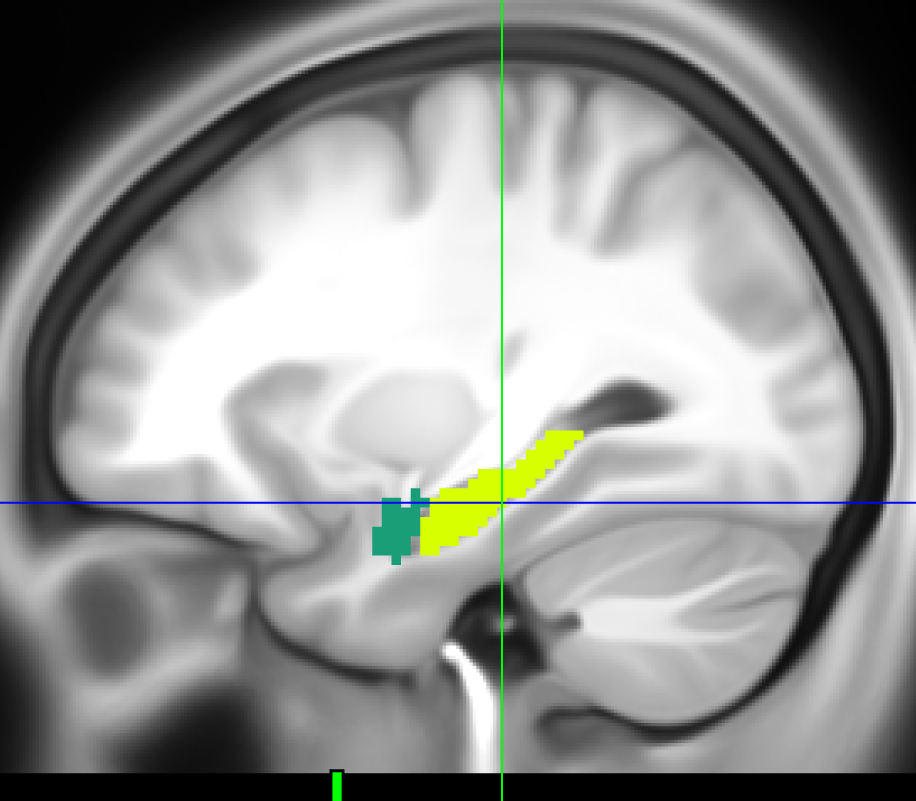

A way to get MNI coordinates for subcortical voxels of a CIFTI file
================

# What do I want to do?

In this post, I will demonstrate how it is possible to use the R
packages `cifti` and `ciftiTools` to get the MNI coordinates of the
subcortical voxels. This table can then be used to select voxels based
on their coordinates and do further things with them (e.g. create
masks).

# Libraries used

``` r
library(data.table)
library(cifti)
library(ciftiTools)
ciftiTools.setOption("wb_path", "D:/Program Files/workbench/bin_windows64")
```

    ## Using this Workbench path: 'D:/Program Files/workbench/bin_windows64/wb_command.exe'.

<details>
<summary>
Click here for detailed session information.
</summary>

Note that I am using `ciftiTools` installed from the 12.0 GitHub branch
even though it still says 0.11.0 below.

``` r
sessioninfo::session_info()
```

    ## - Session info ---------------------------------------------------------------
    ##  setting  value
    ##  version  R version 4.2.2 (2022-10-31 ucrt)
    ##  os       Windows 10 x64 (build 19045)
    ##  system   x86_64, mingw32
    ##  ui       RTerm
    ##  language (EN)
    ##  collate  English_United States.1252
    ##  ctype    English_United States.1252
    ##  tz       Asia/Taipei
    ##  date     2023-07-24
    ##  pandoc   2.19.2 @ C:/Program Files/RStudio/resources/app/bin/quarto/bin/tools/ (via rmarkdown)
    ## 
    ## - Packages -------------------------------------------------------------------
    ##  package      * version date (UTC) lib source
    ##  abind          1.4-5   2016-07-21 [1] CRAN (R 4.2.0)
    ##  base64enc      0.1-3   2015-07-28 [1] CRAN (R 4.2.0)
    ##  bitops         1.0-7   2021-04-24 [1] CRAN (R 4.2.0)
    ##  cifti        * 0.4.5   2018-02-01 [1] CRAN (R 4.2.3)
    ##  ciftiTools   * 0.11.0  2023-07-24 [1] Github (mandymejia/ciftiTools@109fb2e)
    ##  cli            3.6.0   2023-01-09 [1] CRAN (R 4.2.2)
    ##  data.table   * 1.14.8  2023-02-17 [1] CRAN (R 4.2.2)
    ##  digest         0.6.31  2022-12-11 [1] CRAN (R 4.2.2)
    ##  evaluate       0.20    2023-01-17 [1] CRAN (R 4.2.2)
    ##  fastmap        1.1.0   2021-01-25 [1] CRAN (R 4.2.2)
    ##  gifti          0.8.0   2020-11-11 [1] CRAN (R 4.2.3)
    ##  htmltools      0.5.4   2022-12-07 [1] CRAN (R 4.2.2)
    ##  knitr          1.42    2023-01-25 [1] CRAN (R 4.2.2)
    ##  oro.nifti      0.11.4  2022-08-10 [1] CRAN (R 4.2.2)
    ##  R.methodsS3    1.8.2   2022-06-13 [1] CRAN (R 4.2.2)
    ##  R.oo           1.25.0  2022-06-12 [1] CRAN (R 4.2.2)
    ##  R.utils        2.12.2  2022-11-11 [1] CRAN (R 4.2.3)
    ##  RColorBrewer   1.1-3   2022-04-03 [1] CRAN (R 4.2.0)
    ##  Rcpp           1.0.10  2023-01-22 [1] CRAN (R 4.2.2)
    ##  rlang          1.0.6   2022-09-24 [1] CRAN (R 4.2.2)
    ##  rmarkdown      2.20    2023-01-19 [1] CRAN (R 4.2.2)
    ##  RNifti         1.4.5   2023-01-30 [1] CRAN (R 4.2.2)
    ##  rstudioapi     0.14    2022-08-22 [1] CRAN (R 4.2.2)
    ##  sessioninfo    1.2.2   2021-12-06 [1] CRAN (R 4.2.2)
    ##  viridisLite    0.4.1   2022-08-22 [1] CRAN (R 4.2.2)
    ##  xfun           0.37    2023-01-31 [1] CRAN (R 4.2.2)
    ##  xml2           1.3.3   2021-11-30 [1] CRAN (R 4.2.2)
    ##  yaml           2.3.7   2023-01-23 [1] CRAN (R 4.2.2)
    ## 
    ##  [1] C:/Users/Alex/AppData/Local/R/win-library/4.2
    ##  [2] C:/Program Files/R/R-4.2.2/library
    ## 
    ## ------------------------------------------------------------------------------

</details>

# Loading the CIFTI files

Below, you can see how I load CIFTI files based on “A Multi-modal
Parcellation of Human Cerebral Cortex”.

``` r
# Surface and cifti files
cifti_fname  <- "sourceFiles/Q1-Q6_RelatedValidation210.CorticalAreas_dil_Final_Final_Areas_Group_Colors_with_Atlas_ROIs2.32k_fs_LR.dlabel.nii"
surfLeft     <- "sourceFiles/S1200.L.inflated_MSMAll.32k_fs_LR.surf.gii"
surfRight    <- "sourceFiles/S1200.R.inflated_MSMAll.32k_fs_LR.surf.gii"

# Read cifti via ciftiTools
xii <- ciftiTools::read_cifti(cifti_fname, brainstructures = "all", 
                  surfL_fname = surfLeft, 
                  surfR_fname = surfRight)

# Get some info for the cifti file via ciftiTools
xii_info <- info_cifti(cifti_fname)
```

We can get some information of what we just loaded by using

``` r
summary(xii)
```

    ## ====CIFTI METADATA===================
    ## Intent:           3007 (dlabel)
    ## - names           "vertex areas"
    ## Measurements:     1 column
    ## 
    ## ====BRAIN STRUCTURES=================
    ## - left cortex     29696 data vertices
    ##                   2796 medial wall vertices (32492 total)
    ##                   left surface geometry is present
    ## 
    ## - right cortex    29716 data vertices
    ##                   2776 medial wall vertices (32492 total)
    ##                   right surface geometry is present
    ## 
    ## - subcortex       31870 data voxels
    ##                   subcortical structures and number of voxels in each:
    ##                     Cortex-L (0), Cortex-R (0),
    ##                     Accumbens-L (135), Accumbens-R (140),
    ##                     Amygdala-L (315), Amygdala-R (332),
    ##                     Brain Stem (3472),
    ##                     Caudate-L (728), Caudate-R (755),
    ##                     Cerebellum-L (8709), Cerebellum-R (9144),
    ##                     Diencephalon-L (706), Diencephalon-R (712),
    ##                     Hippocampus-L (764), Hippocampus-R (795),
    ##                     Pallidum-L (297), Pallidum-R (260),
    ##                     Putamen-L (1060), Putamen-R (1010),
    ##                     Thalamus-L (1288), Thalamus-R (1248).

These steps can all be done using `ciftiTools`, however as far as I know
we can’t get the XML meta data with `ciftiTools` for this we can use the
package `cifti`.

``` r
# Get the XML meta
xii_xml      <- cifti_xml(cifti_fname)
xii_xml_list <- xml2::as_list(xii_xml)
```

# Get information from XML

After loading the XML data, I am convert it to list using the `xml2`
package. Now, we have loaded everything that is needed to create a table
with all MNI coordinates. `xii_xml_list` is quite a complicated
structure so I am not really going through this. The important bit is
that is contains the VoxelIndicesIJK ([see
here](https://www.slicer.org/wiki/Slicer3:Coordinates)), which we need
to convert to MNI. The voxel index coordinates can be found in matrix
index map:

``` r
matrix_indices_map <- xii_xml_list$CIFTI$Matrix[[3]]
```

In `matrix_indices_map`, List 4 to 22 contains the information for the
subcortical voxels in the order the listed in the summary above. Now, I
will extract all voxel index coordinates and but them into one 31870 x 3
matrix.

``` r
# First lets get the regions in the order
regions <- c("Accumbens-L", "Accumbens-R", "Amygdala-L", "Amygdala-R", "Brain Stem", 
             "Caudate-L", "Caudate-R", "Cerebellum-L", "Cerebellum-R", "Diencephalon-L", 
             "Diencephalon-R", "Hippocampus-L", "Hippocampus-R", "Pallidum-L", "Pallidum-R", 
             "Putamen-L", "Putamen-R", "Thalamus-L",  "Thalamus-L")

# Loop through regions from 4 to 22
numVoxels       <- rep(NA, length(regions))
VoxelIndicesIJK <- matrix(ncol = 3, nrow = 0)


for(i in 4:22){
  # Get the current region and the coordinates as a string
  currentRegion          <- matrix_indices_map[[i]]
  VoxelIndicesIJK_string <- currentRegion$VoxelIndicesIJK[[1]]
  tempM                  <- as.matrix(fread(VoxelIndicesIJK_string))
  
  # Now the we have a matrix of the coordinates, we need to convert them from integer
  # to numeric because otherwise the matrix multiplication doesn't work
  tempM <- matrix(as.numeric(tempM), ncol = ncol(tempM))
  
  # Get the number of voxels for that region
  numVoxels[i - 3] <- nrow(tempM)
  
  # Add to VoxelIndicesIJK
  VoxelIndicesIJK <- rbind(VoxelIndicesIJK, tempM)
}
```

After running this, our matrix `VoxelIndicesIJK` has the desired
dimensions (31870, 3). This fits with the number of subcortical voxels
listed in the summary, so everything is good. Now, we can repeat the
region names so they match the rows of the matrix.

``` r
regions_row <- rep(regions, times = numVoxels)
```

# Convert from voxel index coordinates to MNI

Now we can simply use the translation matrix and follow [these
steps](http://rfmri.org/node/1300). We get the translation matrix from
the meta data.

``` r
A <- xii$meta$subcort$trans_mat
```

The translation matrix is

|     |     |     |      |
|----:|----:|----:|-----:|
|  -2 |   0 |   0 |   90 |
|   0 |   2 |   0 | -126 |
|   0 |   0 |   2 |  -72 |
|   0 |   0 |   0 |    1 |

Now, we need to add a column of 1 (no idea actually why) and transpose
the matrix.

``` r
VoxelIndicesIJK_t <- t(cbind(VoxelIndicesIJK, 1))
```

Once, this is done we can get the MNI coordinates by using this formula:
$MNI^\intercal = A * IJK^\intercal$.

``` r
# Convert from IJK to MNI
MNI <- t(A %*% VoxelIndicesIJK_t)

# Remove unnecessary 4th column
MNI <- MNI[, -4]
```

Now, we got what we wanted, which a 31870 by 3 matrix with the MNI
coordinates as columns. Here are the first six values, which should all
belong the left accumbens:

``` r
head(MNI)
```

    ##      [,1] [,2] [,3]
    ## [1,]   -8    6  -16
    ## [2,]  -10    6  -16
    ## [3,]   -6    8  -16
    ## [4,]   -8    8  -16
    ## [5,]  -10    8  -16
    ## [6,]   -6    4  -14

As a last step, I am going to verify whether the MNI coordinates fit. So
for that, I take a random voxel from the left hippocampus and use
wb_view if this voxel is indeed in the hippocampus based on the
parcellation file used above.

``` r
# Select random voxel
set.seed(20230724)
rowIndex <- sample(which(regions_row == "Hippocampus-L"), 1)

# Show coordinate
MNI[rowIndex, ]
```

    ## [1] -30 -26 -16

When I use wb_view and look this voxel up, then it is definitely in the
hippocampus.



# Write MNI coordinates to .csv file

``` r
# Convert to DF
MNI_DF <- as.data.frame(MNI)

# Add region names as another column
MNI_DF <- cbind(regions_row, MNI_DF)

# Rename columns
names(MNI_DF) <- c("region", "x", "y", "z")

# Write csv
write.csv(MNI_DF, file = "cifti_subcortical_MNI152_coordinates.csv", 
          row.names = FALSE,
          quote = FALSE)
```

This file

``` r
head(MNI_DF)
```

    ##        region   x y   z
    ## 1 Accumbens-L  -8 6 -16
    ## 2 Accumbens-L -10 6 -16
    ## 3 Accumbens-L  -6 8 -16
    ## 4 Accumbens-L  -8 8 -16
    ## 5 Accumbens-L -10 8 -16
    ## 6 Accumbens-L  -6 4 -14

can now be downloaded [here]().
